 

[`Portfolio`](https://usergrail.github.io/) · [`usergraildev@gmail.com`](mailto:usergraildev@gmail.com)

  

<table>
<tr>
<td width="50%" valign="top">

**[`ship-of-drools`](https://github.com/usergrail/ship-of-drools)** 
Rust + Win32 · IL2CPP pointer-chain scanning and live memory editing.

</td>
<td width="50%" valign="top">

**[`Cadence`](https://github.com/usergrail/Cadence)** 
Tauri + React · Local and YouTube audio analysis with BPM detection, key detection, queues, and caching.

</td>
</tr>
</table>

 

<code>Credentials</code>

- Microsoft IT Specialist — Network Security
- Microsoft Technology Associate — Python, 2022
- Microsoft Technology Associate — JavaScript, 2021
- Microsoft Technology Associate — HTML/CSS, 2021

