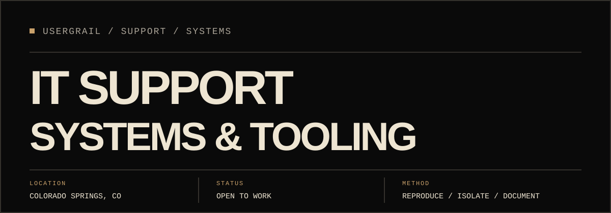
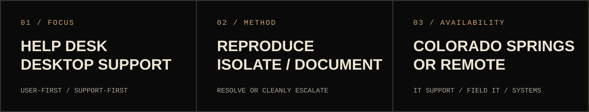
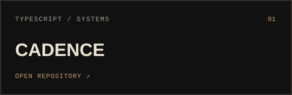
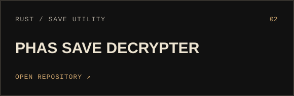
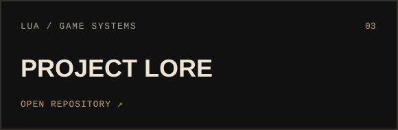
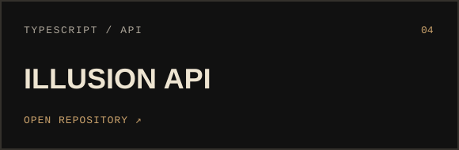

    
  
                
  ## 01 / profile  IT support and systems candidate with customer-facing field experience and seven years of self-directed software, automation, and infrastructure work. I troubleshoot methodically, document what changed, and carry problems through resolution or a clean escalation.  
    
  ## 02 / selected work  
       
 
       
  ## 03 / working set           ## 04 / support foundations  - Windows and Linux troubleshooting - hardware, software, account, Wi-Fi, DNS, and connectivity support - ticket-style workflows using Discord, Trello, and Git issues - customer communication, field diagnosis, documentation, and follow-through - automation and small tools built around real user problems  ## 05 / certifications  - Microsoft IT Specialist � Network Security - Microsoft Technology Associate � Python, 2022 - Microsoft Technology Associate � JavaScript, 2021 - Microsoft Technology Associate � HTML/CSS, 2021  ---  
   <b>open to IT support, help desk, desktop support, technical product support, field IT, and junior systems work</b> 
  
   <a href="https://usergrail.github.io/">portfolio</a> �   <a href="https://www.linkedin.com/in/christopher-workman-44b196230/">linkedin</a> �   <a href="mailto:usergraildev@gmail.com">email</a> 
 